# Overview

::: notes
Backward course design for teaching - "What do you want the audience to take away?"

-   Basics of literature search
    -   Which databases to use
    -   Searching techniques
    -   Sample size
    -   Exporting search metadata
    -   Filtration techniques
-   Statistical Analysis framework
    -   Install R and RStudio
    -   Biblioshiny interface
    -   Bibliometrix scripts
    -   Readability metrics
:::

::: nonincremental
::: columns
::: {.column width="50%"}
-   Background

-   Databases
:::

::: {.column width="50%"}
-   A Shiny Approach

-   A Scripted Approach
:::
:::
:::

# Background

::: nonincremental
-   Why do I feel so bad all the time?

-   What is bibliometrics?

-   Why bibliometrics can help?
:::

## A foundation is key to pushing boundaries

### Background

::: {.notes}

The inherently unstructured nature of graduate school is a big hurdle to pushing the boundary of what is know - there is no guide

:::

::: {.columns}

Graduate school

:::: {.column width="75%"}

-   Understand what is known across a domain
-   Identify and explain something that is unknown (Preferably, coherently)
-   Ultimately, unstructured with many possible options

::::

:::: {.column width='25%'}

::::

:::

::: {.absolute right="100" top="10%"}

<div class="simple-sci-know">
  <input type="checkbox" id="circle-toggle">
  <label for="circle-toggle" class="circle">All Scientific Knowledge</label>
  <div class="red-circle"></div>
</div>

:::

::: {.absolute left="0" bottom="0"}

<div class="wavy-sci-know">
  <input type="checkbox" id="toggle-circle" />
  <label for="toggle-circle" class="wavy-circle">All Scientific Knowledge</label>
  <div class="red-circle"></div>
</div>

:::

## [Improve personal professional care with systematic approaches]{.small}

### Background

::: {.columns}

:::: {.column}

::::: {.r-stack}

:::::: {.fragment}

Feelings of:

::::::: {.nonincremental .smaller}

- guilt
- all-consuming prioritization
- wealth disparity
- depression
- anxiety
- stupidity
- uncertainty and disconnection (I.e. Lost)
- urgency and pressure (I.e. time slipping away
- regret
- stress
- isolation

:::::::

::::::

::::::: {.fragment .remove-on-next}

Solutions?

- [grin and bear it](https://smea.uw.edu/currents/managing-graduate-school-with-depression/){target="_blank"}
- too general to fully address the scope

:::::::

:::::

::::

:::: {.column}

{.smaller}](images/graduate-school-mental-health.png){.lightbox}

::::

:::


## [The valley of despair is the graduate school experience]{.small} {auto-animate="true"}

### Background

::: notes
Imposter syndrom

pop sci - dunning-krueger and grant hype cycle

http://www.avasthilab.org/2020/05/21/navigating-the-valley-of-despair-aka-years-4-end-of-grad-school/
:::

::: columns
::: {.column width="50%"}
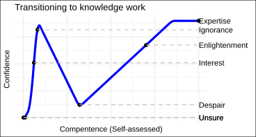
:::

::: {.column width="50%"}
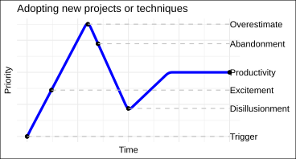
:::
:::


## [The vallies are peak imposter syndrome]{.small} {auto-animate="true" visibility="uncounted"}

### Background

::: columns
::: {.column width="50%"}

:::

::: {.column width="50%"}
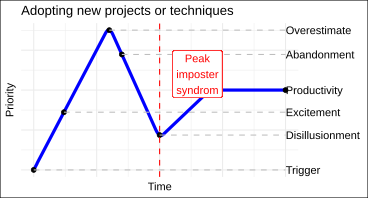
:::
:::

[Bibliometrics can rapidly build your compentence in a domain]{.fragment}

[Bibliometrics can expose you to the techniques of a domain]{.fragment}

## [Bibliometrics provides an accesible framework for equitable scholarship]{.smaller}

### Background

["\[Bibliometrics is\] The measurement of all aspects related to the publication and reading of books and documents."](https://www.nature.com/articles/510218e){target="_blank"}

::: columns
::: {.column width="50%"}
-   [Bibliometrics uses]{.fragment}

    -   Archival database
    -   Article metadata
    -   Statistical analysis
:::

::: {.column width="50%"}
-   [Bibliometrics answers]{.fragment}

    -   where the field has grown from
    -   its most relevant articles
    -   its emerging topics
:::
:::

## [Bibliometrics yields networks based on references]{.small}

### Background



## [Minimize your time in the Valley with bibliometrics]{style="font-size:0.80em;"}

### Background

-   General bibliometric science yields:
    -   A solid foundation of the necessary concepts
    -   The questions answered by the field
    -   Some open areas of discovery within the field
-   My proposed use of a bibliometric framework
    -   Use **reproducible** methods
    -   for **systematic** evaluation
    -   in a **quantifiable** way!
    -   Ultimately, ending with justifiable literature for your needs

# Databases

::: nonincremental
-   Basics of literature search
    -   Which databases to use
    -   Searching techniques
    -   Sample size
    -   Exporting search metadata
    -   Filtration techniques
:::

## [Your database choice ***will*** affect your results]{style="font-size:0.80em"}

### Databases

::: notes
[Each database has its benefits and drawbacks](https://direct.mit.edu/qss/article/2/1/20/97574/Large-scale-comparison-of-bibliographic-data), but scopus and web of science are the competing standard. They also have the best metadata curation for our analysis

https://paperpile.com/g/academic-research-databases/
:::

Databases focus on different levels of content selection, curation, and comprehensiveness.

::: nonincremental
::: columns
::: {.column width="50%"}
-   Web of Science (WoS)
-   Scopus
-   PubMed
-   Dimensions
-   CrossRef
:::

::: {.column width="50%"}
::: {data-id="text"}
-   Semantic Scholar
-   Microsoft Academic
-   Lens.org
-   Cochran Library
-   Google Scholar
:::
:::
:::
:::

[["Scopus and WoS compliment each others as neither resource is all inclusive"](https://www.ncbi.nlm.nih.gov/pmc/articles/PMC1420322/){target="_blank"}]{.smaller}

## [Your database choice ***will*** affect your results]{style="font-size:0.80em"}

### Databases

::: notes
[Each database has its benefits and drawbacks](https://direct.mit.edu/qss/article/2/1/20/97574/Large-scale-comparison-of-bibliographic-data){target="_blank"}, but scopus and web of science are the competing standard. They also have the best metadata curation for our analysis

https://paperpile.com/g/academic-research-databases/
:::

Databases focus on different levels of content selection, curation, and comprehensiveness.

::: nonincremental
::: columns
::: {.column width="50%"}
-   **Web of Science (WoS)**
-   **Scopus**
-   **PubMed**
-   [Dimensions]{.op style="font-size: 0.75em"}
-   [CrossRef]{.op style="font-size: 0.75em"}
:::

::: {.column width="50%"}
::: {.op style="font-size: 0.75em"}
-   Semantic Scholar
-   Microsoft Academic
-   Lens.org
-   Cochran Library
-   Google Scholar
:::
:::
:::
:::

[["Scopus and WOS compliment each others as neither resource is all inclusive"](https://www.ncbi.nlm.nih.gov/pmc/articles/PMC1420322/){target="_blank"}]{.smaller}

## [Signing up, search and exporting can be nuianced]{.small}

### Databases 

- Register with university email for Scopus and WoS access when off university wifi/[library VPN](https://library.ucdavis.edu/vpn/)
    - PubMed does not require registration at all

::: {.columns}
:::: {.column width="33%"}

-
  - [Scopus](https://www.scopus.com/search/form.uri?display=basic#basic){target="_blank"} [(Multidisciplinary)]{.smaller}
    - 82.4 million records
    - 1788 – present
    - bibtex 
    - full record 
    - 20,000 export limit

::::

:::: {.column width="33%"}
- 
  - [WoS](https://www.webofscience.com/wos/woscc/basic-search){target="_blank"} [(Multidisciplinary)]{.smaller}
    - Core, 79 million
    - 1900 - present
    - plaintext or bibtex 
    - custom selection
    - 1000 export limit

::::

:::: {.column width="33%"}
- 
  - [PubMed](https://pubmed.ncbi.nlm.nih.gov/){target="_blank"} [(Only life science and biomedical)]{.smaller}
    - 35 million
    - 1966 - present (*1809)
    - plaintext
    - pubmed format
    - 10,000 export limit

::::
:::

## Vocabulary is vital for a good search! {.smaller}

### Databases

controlled vocabulary thesaurus

-   [**Me**dical **S**ubject **H**eadings (MeSH) Tree](https://meshb.nlm.nih.gov/){target="_blank"}
-   Search "controlled vocabulary thesaurus for \[biology\]"

::: {.fragment}
Try [ChatGPT](https://chat.openai.com/){target="_blank"}?

> What are keywords for \[microbial metagenomic metabolomic metabolite cancer research\]?

> Create a controlled vocabulary for \[microbial metagenomic metabolomic metabolite cancer research\].

:::

```{r Timer vocab}
#| echo: false
countdown::countdown(minutes = 5, seconds = 0, warn_when = 120, 
                     right = "0%", top = "10%",
                     blink_colon = TRUE, id = "special_timer")
```

## [Wildcards allow the capture of many individual words]{style="font-size:0.80em;"}

### Databases

::: {style="font-size: 0.75em"}
| Wildcard Charater | Definition                                | Example | Result                                           |
|:-----------------:|:-----------------|:-----------------:|:-----------------|
|        \*         | Any amount of character/s to include zero | `*man`  | `man, woman, human, superman, superwoman, {etc}` |
|         ?         | Any single character                      | `wom?n` | `woman, women`                                   |
|   \$ (WoS only)   | Any single or no character                | `$$man` | `woman, man, human`                              |

: Wildcards {#tbl-wd}
:::

## [Boolean operators are vital to focus a corpus]{style="font-size:0.80em;"}

### Databases

::: vscroll
::: {style="font-size: 0.75em"}
|     Operator      | Affect on Search | Definition                                                                           | Example                               |
|:------------------:|:-----------------|:-----------------|:-----------------|
|      **AND**      | Narrows          | Intersects *all* terms separated by operator                                               | `migration AND butterfl*`            |
|      **OR**       | Broadens         | Unites *any* and *all* terms separated by operator                                     | `migration OR butterfl*`             |
|      **NOT**      | Narrows          | Excludes term following operator                                                     | `migration AND bird* NOT butterfl*` |
|  **NEAR/x**(WoS)  | Narrows          | Find terms joined by operator *near* each other by $x$ words                         | `America NEAR/10 butterfly`           |
|   **SAME**(WoS)   | Narrows          | Find terms joined by operator if in the *same* sentence                              | `America SAME butterfly`              |
|  **W/n**(Scopus)  | Narrows          | Find terms joined by operator *within* each other by $n$ words                       | `American W/10 butterfly`             |
| **Pre/n**(Scopus) | Narrows          | Find terms where *preceeding* term to operator is within $n$ words of following term | `American Pre/3 butterfly`            |

: Boolean Operators {#tbl-bo}
:::
:::

## Searching by phrase may simplify a search

### Databases

::: {style="font-size: 0.75em"}
|    Phrase type    |       Example        |                       Search                       |
|:----------------------:|:----------------------:|:----------------------:|
|     **Loose**     | `"phrase searching"` | `phrase search, phrase searches, phrase searching` |
| **Exact**(Scopus) | `{phrase searching}` |                 `phrase searching`                 |

: Pharse Searching {#tbl-ps}
:::

::: notes
lemmatization and stemming (i.e. techniques to reduce words to their root form)

loose allows for wildcards to be included in the quotations. exact will search for the exact characters inbetween the curly braces (do not include wildcards)
:::

## [Combine all search techniques for the best corpus results]{.small} {auto-animate="true"}

### Databases

WoS = 184

::: {.smaller data-id="wos"}
> ALL=(("colorectal cancer\*" OR "colorectal neoplas\*" OR "adenomatous polyposis coli" OR "colon\* neoplas\*" OR "rectal neoplas\*" OR "hereditary nonpolypo\*") AND ("metagenom\*" AND "metabol\*"))
:::

Scopus = 367 & PubMed = 248

::: {.smaller data-id="scopus"}
> TITLE-ABS-KEY ( "colorectal cancer\*" OR "colorectal neoplas\*" OR "adenomatous polyposis coli" OR "colon\* neoplas\*" OR "rectal neoplas\*" OR "hereditary nonpolypo\*" AND "metagenom\*" AND "metabol\*" )
:::

## [Combine all search techniques for the best corpus results]{.small} {auto-animate="true"}

### Databases

WoS = 184

::: {.small data-id="wos"}
> ALL=([**(**]{style="color: red;"}"colorectal cancer\*" OR "colorectal neoplas\*" OR "adenomatous polyposis coli" OR "colon\* neoplas\*" OR "rectal neoplas\*" OR "hereditary nonpolypo\*"[**) AND (**]{style="color: red;"}metagenom\*" AND "metabol\*"[**)**]{style="color: red;"})
:::

Scopus = 367 & PubMed = 248

::: {.smaller data-id="scopus"}
> TITLE-ABS-KEY ( "colorectal cancer\*" OR "colorectal neoplas\*" OR "adenomatous polyposis coli" OR "colon\* neoplas\*" OR "rectal neoplas\*" OR "hereditary nonpolypo\*" AND "metagenom\*" AND "metabol\*" )
:::

## [Sample Size goals of 500 - 1500 articles]{.small}

### Databases

```{=html}
<style>
.container {
  position: relative;
  width: 100%;
}

.image {
  opacity: 1;
  display: block;
  width: 100%;
  height: auto;
  transition: .5s ease;
  backface-visibility: hidden;
}

.middle {
  transition: .5s ease;
  opacity: 0;
  position: absolute;
  top: 50%;
  left: 50%;
  transform: translate(-50%, -50%);
  -ms-transform: translate(-50%, -50%);
  text-align: center;
}

.container:hover .image {
  opacity: 0.3;
}

.container:hover .middle {
  opacity: 1;
}

.text {
  background-color: #04AA6D;
  color: white;
  font-size: 16px;
  padding: 16px 32px;
}
</style>

<div class="container">
  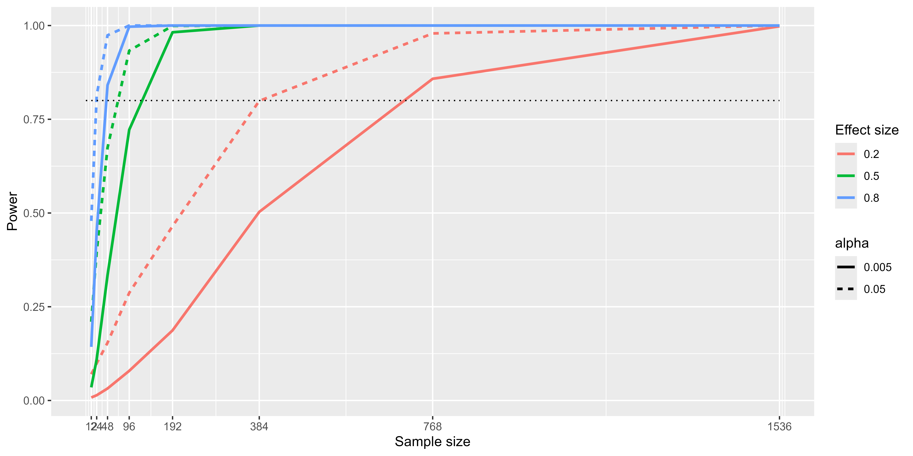
  <div class="middle">
    Results from power simulation, showing power as a function of sample size, with effect sizes shown as different colors, and alpha shown as line type. The standard criterion of 80 percent power is shown by the dotted black line.
  </div>
</div>
```

## Build a corpus for your interests

### Databases

Focus on [WoS](https://www.webofscience.com){target="_blank"} and/or [Scopus](https://www.scopus.com){target="_blank"}

::: {.notes}
Keep in mind, from this point on a literature search should only ever take a maximum of 10-15 minutes.

Refer back to @tbl-wd, @tbl-bo, @tbl-ps
:::

```{r Timer corpus}
#| echo: false
countdown::countdown(minutes = 10, seconds = 0, warn_when = 120, 
                     right = "0%", top = "0%",
                     blink_colon = TRUE, id = "special_timer")
```

::: vscroll
::: {#tbl-panel layout-ncol="1"}
::: {style="font-size: 0.75em"}
<hr/>

| Wildcard Charater | Definition                                | Example | Result                                           |
|:-----------------:|:-----------------|:-----------------:|:-----------------|
|        \*         | Any amount of character/s to include zero | `*man`  | `man, woman, human, superman, superwoman, {etc}` |
|         ?         | Any single character                      | `wom?n` | `woman, women`                                   |
|   \$ (WoS only)   | Any single or no character                | `$$man` | `woman, man, human`                              |

: Wildcards
:::

::: {style="font-size: 0.75em"}
<hr/>

|     Operator      | Affect on Search | Definition                                                                           | Example                               |
|:------------------:|:-----------------|:-----------------|:-----------------|
|      **AND**      | Narrows          | Find *all* terms separated by operator                                               | `migration AND butterfl\*`            |
|      **OR**       | Broadens         | Find *any* and *all* terms separated by operator                                     | `migration OR butterfl\*`             |
|      **NOT**      | Narrows          | Excludes term following operator                                                     | `migration AND bird\* NOT butterfl\*` |
|  **NEAR/x**(WoS)  | Narrows          | Find terms joined by operator *near* each other by $x$ words                         | `America NEAR/10 butterfly`           |
|   **SAME**(WoS)   | Narrows          | Find terms joined by operator if in the *same* sentence                              | `America SAME butterfly`              |
|  **W/n**(Scopus)  | Narrows          | Find terms joined by operator *within* each other by $n$ words                       | `American W/10 butterfly`             |
| **Pre/n**(Scopus) | Narrows          | Find terms where *preceeding* term to operator is within $n$ words of following term | `American Pre/3 butterfly`            |

: Boolean Operators
:::

::: {style="font-size: 0.75em"}
<hr/>

|    Phrase type    |       Example        |                       Search                       |
|:----------------------:|:----------------------:|:----------------------:|
|     **Loose**     | `"phrase searching"` | `phrase search, phrase searches, phrase searching` |
| **Exact**(Scopus) | `{phrase searching}` |                 `phrase searching`                 |

: Phrase Searching
:::

Wildcards, Boolean Operators, Phrase Searching
:::
:::

## [Filtration techniques are whatever work for you]{.small}{data-menu-title="Filtration techniques: Prisma"}

### Databases

::: {.notes}
Prisma https://www.sciencedirect.com/science/article/pii/S0895435609001802?via%3Dihub

80-20 method while scrolling through database? refer to a better way - metagear here?
:::

::: {.columns}
:::: {.column width="65%"}
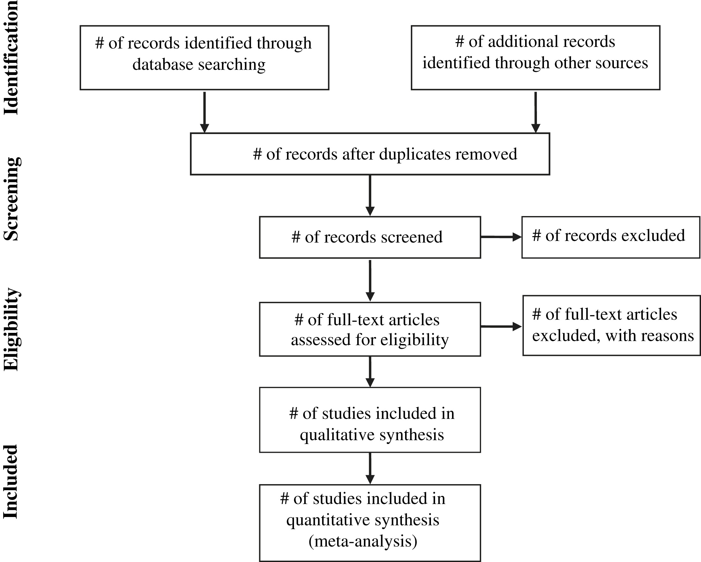
::::

:::: {.column width="35%"}
Literature filtration

::::: nonincremental
- Prisma
:::::
::::
:::

## [Filtration techniques are whatever work for you]{.small}{data-menu-title="Filtration techniques:80:20"}

### Databases

::: {.notes}
Prisma https://www.sciencedirect.com/science/article/pii/S0895435609001802?via%3Dihub

80-20 method while scrolling through database? refer to a better way - metagear here?
:::

::: {.columns}
:::: {.column width="65%"}
{width=75%}
::::

:::: {.column width="35%"}
Literature filtration

::::: nonincremental
- [Prisma]{.op}
- 80:20
:::::
::::
:::

## [Filtration techniques are whatever work for you]{.small}{data-menu-title="Filtration technique: `metagear`"}

### Databases

::: {.notes}
Prisma https://www.sciencedirect.com/science/article/pii/S0895435609001802?via%3Dihub

80-20 method while scrolling through database? refer to a better way - metagear here?
:::

::: {.columns}
:::: {.column width="65%"}
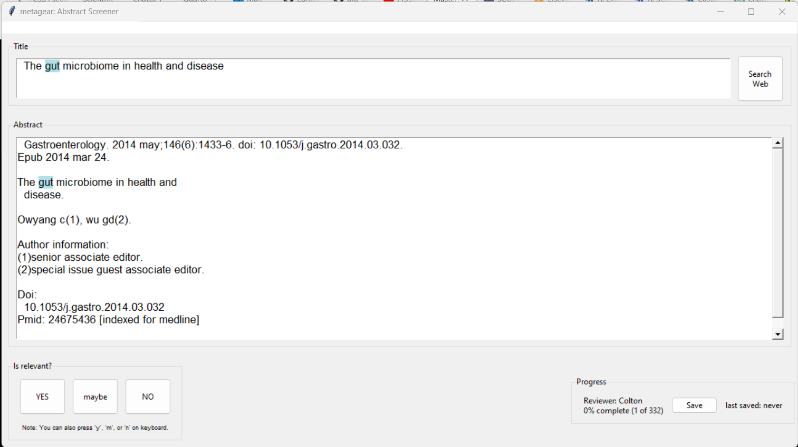
::::

:::: {.column width="35%"}
Literature filtration

::::: nonincremental
- [Prisma]{.op}
- [80:20]{.op}
- `metagear`?
:::::
::::
:::

# A Shiny Approach

::: nonincremental
-   The Bibliometrix package
-   Biblioshiny interface
-   Some standard bibliometric plots
:::

## [Install, load, and run `biblioshiny()` in almost no code]{.small}

### A Shiny Approach

::: notes
https://stat.ethz.ch/R-manual/R-devel/library/base/html/ns-dblcolon.html double colon operator (pkg::name)
:::

::: panel-tabset
#### Install

```{r Install a library}
#| eval: false
#| echo: true
# Install the bibliometrix package

install.packages('bibliometrix')
```

#### Load

```{r Load a library}
#| eval: false
#| echo: true
# Load the bibliometrix library

library(bibliometrix) # Load and analyze bibliograpic data
```

#### Run

```{r Run a function}
#| eval: false
#| echo: true
# Run the biblioshiny shiny application

biblioshiny()
```

#### Quicker?

```{r Install and lazy load}
#| eval: false
#| echo: true
# Install the bibliometrix package

install.packages('bibliometrix')

# Lazy load and Run the biblioshiny shiny application

bibliometrix::biblioshiny()
```
:::

## Your console should look like...

### A Shiny Approach

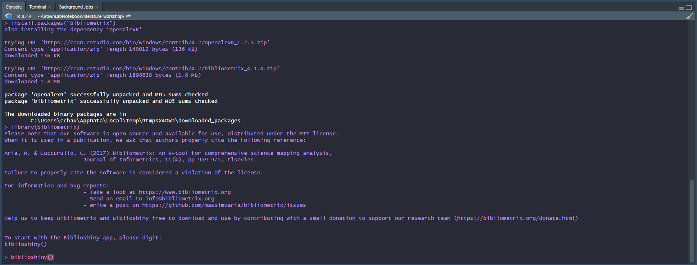

## This is the landing page every time

### A Shiny Approach

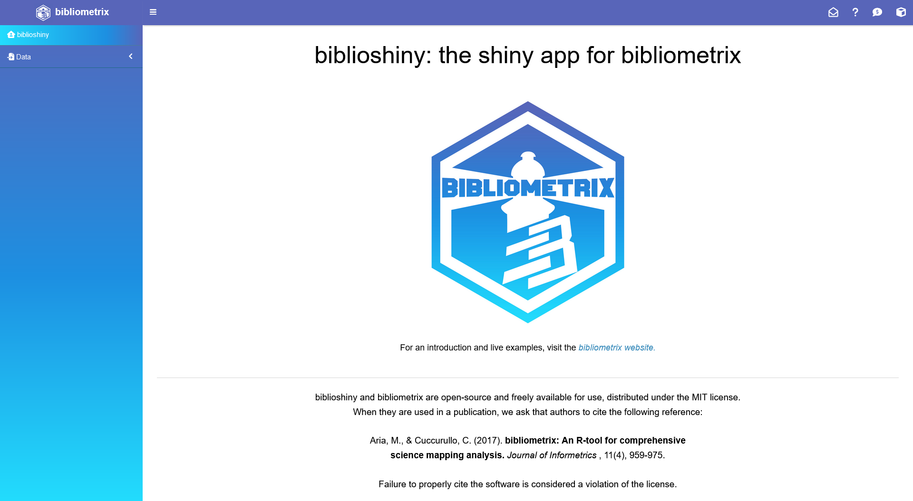

## Loading allows only a single file...

### A Shiny Approach

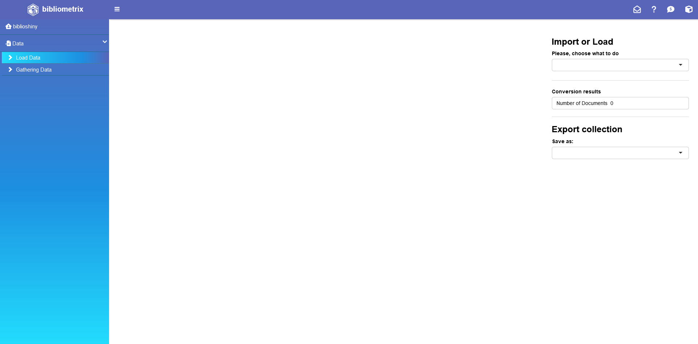

## Metadata report of my corpus

### A Shiny Approach

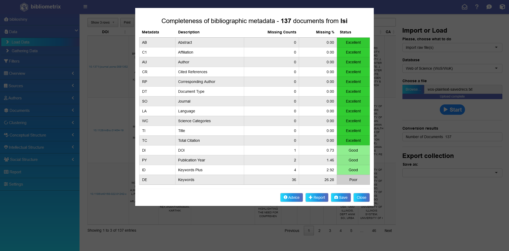

## Loaded data in tabular form

### A Shiny Approach

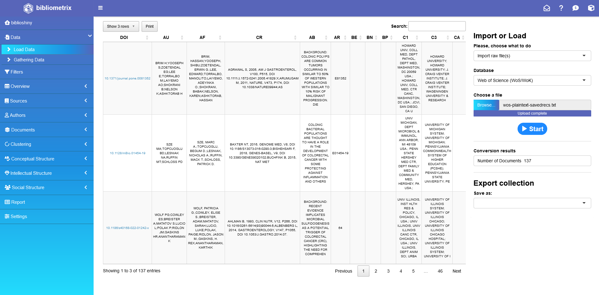

## Relavant sources to include in my RSS feeds

### A Shiny Approach

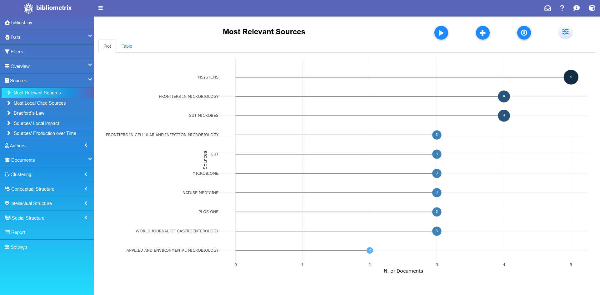

## [The most cited documents across the database]{.small}

### A Shiny Approach

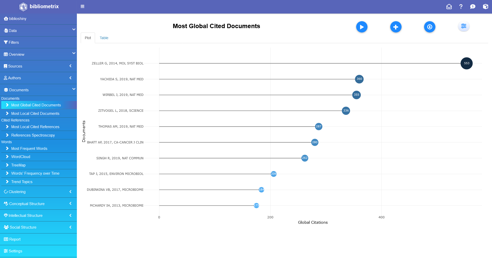

::: notes
"GC: Global Citation Counts the number of citations that an article in the collection has received from all the publications indexed in the source (In this paper: Retrieved from Scopus)"

"LC: Local Citation Counts the number of citations a document received from other articles in the collection (Calculated by Bibliometrix based on the references cited by the papers within the collection)"

https://www.sciencedirect.com/science/article/pii/S2405844023002530?via%3Dihub
:::

## [A normalized citation count allows for more current articles]{.small}

### A Shiny Approach

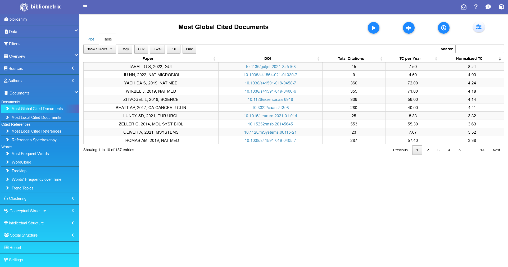

::: notes
"GC: Global Citation Counts the number of citations that an article in the collection has received from all the publications indexed in the source (In this paper: Retrieved from Scopus)"

"LC: Local Citation Counts the number of citations a document received from other articles in the collection (Calculated by Bibliometrix based on the references cited by the papers within the collection)"

https://www.sciencedirect.com/science/article/pii/S2405844023002530?via%3Dihub
:::

## [A longitudinal network focuses in on local seminal papers]{.small}

### A Shiny Approach

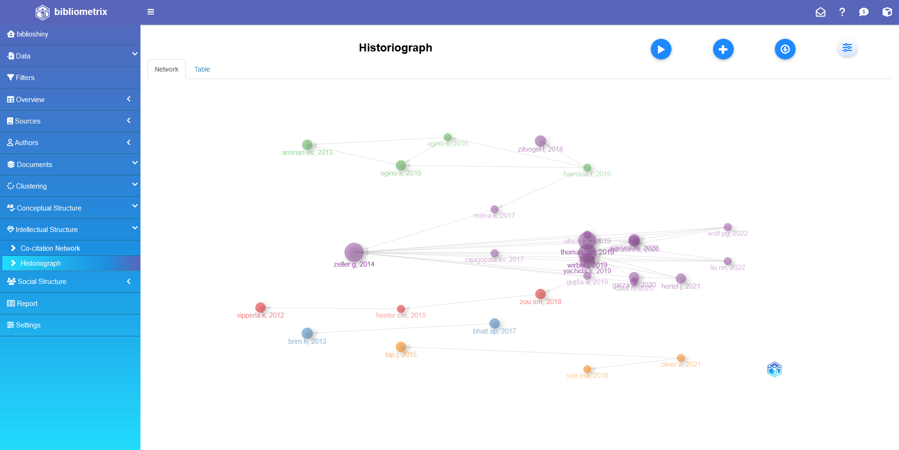

## [Peaks within the 5 year median may be cornerstone papers]{.small}

### A Shiny Approach

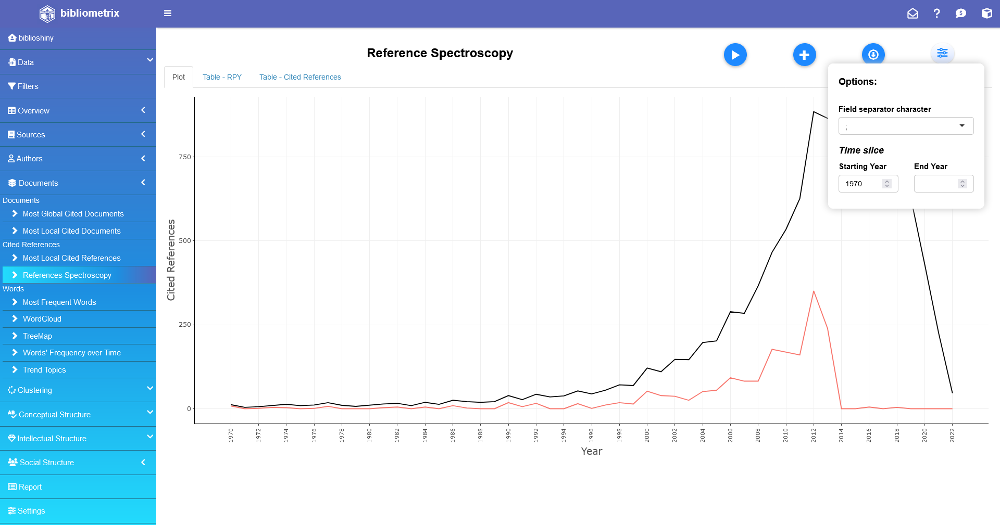

## At a small peak no papers stand out

### A Shiny Approach


## At greater peaks, some articles outlie the norm

### A Shiny Approach

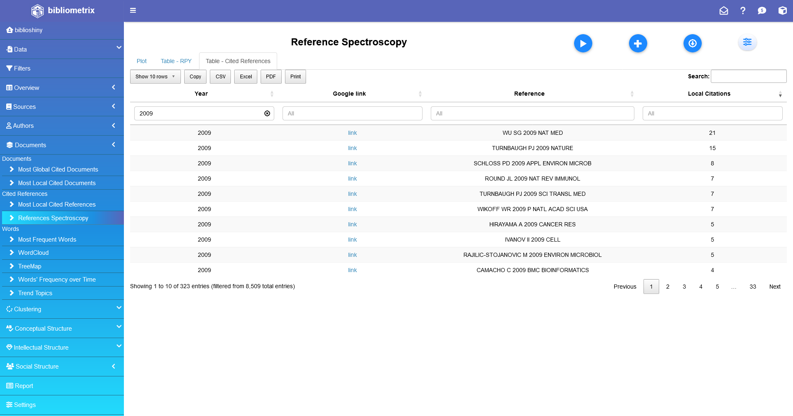

## At greater peaks, some articles outlie the norm

### A Shiny Approach


## Explore the corpus you have created

### A Shiny Approach

-   [First four sections - Domain focus at four different analyses](https://bibliometrix.org/biblioshiny/biblioshiny2.html){target="_blank"}
    -   For example, the `Sources` section is a great level for refining the journals in your RSS feed!
-   [Last three sections - Knowledge structures for rapid synthesis of understanding](https://bibliometrix.org/biblioshiny/biblioshiny3.html){target="_blank"}
    -   For example, the `Conceptual Structure` is a great section for rapidly identifying key themes, trends, and keywords that are best to fundamentally understand or include in your controlled vocabulary thesuarus!

```{r Timer biblioshiny}
#| echo: false
countdown::countdown(minutes = 10, seconds = 0, warn_when = 120, 
                     right = "0%", top = "0%",
                     blink_colon = TRUE, id = "special_timer")
```

# A Scripted Approach

::: nonincremental
-   Replicate `biblioshiny()` plots

-   Examine, plot, and summarize data

-   Deeply understand some functions

-   Integrate R script output with Zotero
:::

::: notes
To unlock the potential of a single library or package, need a script and other complimentary packages
:::

# Summary {.smaller}

You have learned:

::: nonincremental
-   Why the struggle exists
    -   One method to alleviate some pressure
-   Databases
    -   Bibliographic databases
    -   Search engine techniques
    -   Sampling size
    -   Exportation and Filtration
-   Bibliometric Analysis
    -   One tool
    -   Two approaches
    -   Standard data analysis in R
    -   Interoperation with RSS and Reference management
:::

## Acknowledgments

### "Alone we can do so little; together we can do so much."<br>Helen Keller

::: nonincremental
-   C. Titus Brown
-   Pamela Reynolds
-   Bryshal Moore
-   Megan Van Noord
-   DIB Lab members
-   DataLab members
:::

```{css checkboxCircle, echo=FALSE}
/* Hide the input checkbox */
input[type="checkbox"] {
  display: none;
}

/* Default circle styles */
.circle {
  display: flex;
  justify-content: center; /* Align horizontal */
  align-items: center; /* Align vertical */
  text-align: center;
  width: 50px;
  height: 50px;
  border-radius: 50%;
  background-color: blue;
  transition: all 0.3s ease;
  cursor: pointer;
  font-size: 0.1em;
}

/* Scale the circle larger on click */
input[type="checkbox"]:checked + .circle {
  display: flex;
  justify-content: center; /* Align horizontal */
  align-items: center; /* Align vertical */
  width: 300px;
  height: 300px;
  font-size: 1.2em;
  margin-bottom: 100px;
}

/* Create a small bump on the edge of the circle on second click */
input[type="checkbox"]:checked:checked + .circle::after {
  content: "";
  position: absolute;
  width: 8px;
  height: 8px;
  border-radius: 50%;
  background-color: red;
  bottom: -2.5px;
  right: 150px;
}

/* Arrow */
input[type="checkbox"]:checked:checked + .circle::before {
  content: "\2191" "\A" "You"; /*unicode for up arrow*/
  white-space: pre;
  position: absolute;
  bottom: -100px;
  right: 118px;
}

/* Reset circle on third click */
input[type="checkbox"]:checked:checked:checked + .circle {
  transform: scale(1);
}

```
